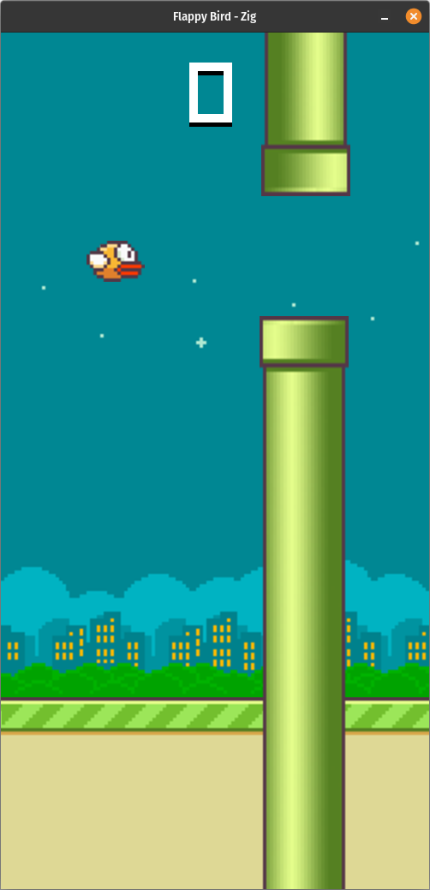

# Flappy Bird - Zig Edition

A faithful port of Flappy Bird from JavaScript to Zig using raylib.



## About This Port

This game was originally written in JavaScript using raylib-js and has been converted to Zig. The conversion demonstrates the dramatic efficiency gains of compiled languages:

- **JavaScript build**: Over 100 MB (including Node.js runtime and dependencies)
- **Zig build**: 2-7 MB (standalone executable with no external dependencies)

That's a **95%+ reduction in size** while maintaining the same gameplay and features, with improved performance from native compilation.

## Building

### Quick Build
```bash
./build.sh           # Release builds for Linux & Windows
./build.sh --debug   # Debug builds for Linux & Windows
```

### Manual Build
```bash
zig build                              # Debug build (Linux)
zig build -Doptimize=ReleaseFast      # Optimized build (Linux)
zig build -Dtarget=x86_64-windows     # Windows build
```

## Running

### Linux
```bash
cd dist
./flappy-linux-x64
```

### Windows
1. Copy `dist/flappy-windows-x64.exe` to Windows
2. Copy `dist/assets/` folder to same location
3. Run `flappy-windows-x64.exe`

**For Windows without GPU (Docker/VM):**
```cmd
set MESA_GL_VERSION_OVERRIDE=3.3
flappy-windows-x64.exe
```

Or try running with software OpenGL drivers.

## File Sizes

- **Debug build**: ~17 MB (Linux)
- **ReleaseFast**: 7.6 MB (Linux), 2.1 MB (Windows)
- **ReleaseSmall**: 1.3 MB (Linux)
- **Assets**: 460 KB

## Controls

- **Any key** - Flap/Jump
- **ESC** - Exit
- **X button** - Close window (works during game and game over screen)

## Project Structure

```
Zig/
├── build.zig          # Build configuration
├── build.zig.zon      # Package dependencies
├── build.sh           # Build script
├── src/
│   ├── main.zig           # Entry point
│   ├── Game.zig           # Main game loop
│   ├── Bird.zig           # Bird physics & collision
│   ├── Background.zig     # Backgrounds & scrolling base
│   ├── Obstacles.zig      # Pipe generation & movement
│   ├── Score.zig          # Score tracking
│   └── GameOverScreen.zig # Game over screen
├── assets/
│   ├── sprites/       # Game sprites
│   └── audio/         # Sound effects
└── dist/              # Built executables (after build)
```

## Dependencies

- Zig 0.16.0-dev or later
- raylib-zig 5.6-dev (automatically fetched)
- raylib 5.6-dev (bundled with raylib-zig)

## Features

- ✅ Smooth 60 FPS gameplay
- ✅ Bird physics with flapping
- ✅ Animated bird sprites
- ✅ Procedural pipe generation
- ✅ Collision detection
- ✅ Score tracking with speed increase
- ✅ Sound effects (flap, score, death)
- ✅ Day/night backgrounds
- ✅ Scrolling ground
- ✅ Game over screen with restart
- ✅ Proper window close handling
- ✅ Cross-platform (Linux, Windows)
- ✅ Tiny binary size
- ✅ No external dependencies

## Differences from JS Version

- Manual memory management (with allocators)
- Explicit error handling (try/catch)
- Static typing throughout
- ~350x smaller binary size (2.1MB vs 700MB+ with Node.js)
- Better performance (compiled vs interpreted)

## License

Based on the original Flappy Bird JavaScript implementation.
